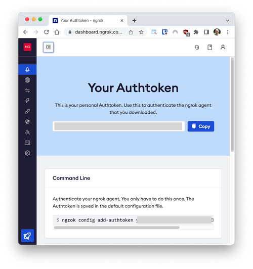

# ATS-AI-resume-automation
The Resume Matcher takes your resume and job descriptions as input, parses them using Python, and mimics the functionalities of an ATS, providing you with insights and suggestions to make your resume ATS-friendly.

By [<b>shamshad ahmed</b>](mailto:smshad0001@gmail.com).

Connect with me on social media and explore my work:

[](https://www.linkedin.com/in/iamsamkhan/)
[](https://github.com/iamsamkhan)
[](https://medium.com/@iamsamkhan)
[](https://twitter.com/iamsamkhan__)
[](https://discord.com/users/iamsamkhan)
[](https://github.com/sponsors/iamsamkhan)
The Resume Matcher takes your resume and job descriptions as input, parses them using Python, and mimics the functionalities of an ATS, providing you with insights and suggestions to make your resume ATS-friendly.


<div align="center">

# Resume Matcher


### Resume Matcher is an AI Based Free & Open Source Tool. To tailor your resume to a job description. Find the matching keywords, improve the readability  and gain deep insights into your resume.

</div>

<br>

<div align="center">


[](https://www.resumematcher.fyi)

Upvote us on [ProductHunt 🚀](https://www.producthunt.com/products/resume-matcher).

<a href="https://www.producthunt.com/posts/resume-matcher?utm_source=badge-featured&utm_medium=badge&utm_souce=badge-resume&#0045;matcher" target="_blank"></a>

</div>

<div align="center">

**Don't let your resume be a roadblock from getting your next job. Use Resume Matcher!**


## How does it work?

</div>

The Resume Matcher takes your resume and job descriptions as input, parses them using Python, and mimics the functionalities of an ATS, providing you with insights and suggestions to make your resume ATS-friendly.

The process is as follows:

1. **Parsing**: The system uses Python to parse both your resume and the provided job description, just like an ATS would.

2. **Keyword Extraction**: The tool uses advanced machine learning algorithms to extract the most relevant keywords from the job description. These keywords represent the skills, qualifications, and experiences the employer seeks.

3. **Key Terms Extraction**: Beyond keyword extraction, the tool uses textacy to identify the main key terms or themes in the job description. This step helps in understanding the broader context of what the resume is about.

4. **Vector Similarity Using Qdrant**: The tool uses [Qdrant](https://github.com/qdrant/qdrant), a highly efficient vector similarity search tool, to measure how closely your resume matches the job description. The more similar they are, the higher the likelihood that your resume will pass the ATS screening.

<br/>

<div align="center">

## How to install

</div>

Follow these steps to set up the environment and run the application.

1. Fork the repository [here](https://github.com/iamsamkhan/ATS-Resume-LLMs-AI-Matcher-automation/fork).

2. Clone the forked repository.

   ```bash
   git clone https://github.com/iamsamkhan/ATS-Resume-LLMs-AI-Matcher-automation.git
   cd Resume-Matcher
   ```

3. Create a Python Virtual Environment:

Install virtualenv in Python
A virtual environment in Python allows you to create an isolated environment for your projects. It means that your projects can have their own dependencies – independent of every other project's dependencies.

With a Python virtual environment for each project, you are free to install different versions of the same Python package for each project. This is because every Python environment is independent of all the others.

At their core, virtual environments in Python are just directories containing a few scripts; consequently, you can set as many Python virtual environments as you like.

Let’s install virtualenv in Python!

virtualenv is easy to install. First, let's update pip.

pip install --upgrade pip
 
pip --version
My output:

pip 22.0.3
Next, you can install virtualenv:

pip install virtualenv
Now that virtualenv is installed, let's create a virtual environment in Python called mytest:

virtualenv -p python3.11 myenv

   

   **OR**

4. Activate the Virtual Environment.

   - On Windows.

     ```bash
     env\Scripts\activate
     ```

   - On macOS and Linux.

     ```bash
     source env/bin/activate
     ```

      ```
   - pyenv installer
     ```
        curl https://pyenv.run | bash
     ```
   - Install desired python version
     ```
       pyenv install -v 3.11.0
     ```

   - pyenv with virtual enviroment
     ```
        pyenv virtualenv 3.11.0 venv
     ```

   - Activate virtualenv with pyenv
     ```
        pyenv activate venv
     ```

5. Install Dependencies:

   ```bash
   pip install -r requirements.txt
   ```

6. Prepare Data:

   - Resumes: Place your resumes in PDF format in the `Data/Resumes` folder. Remove any existing contents in this folder.
   - Job Descriptions: Place your job descriptions in PDF format in the `Data/JobDescription` folder. Remove any existing contents in this folder.

7. Parse Resumes to JSON:

   ```python
   python run_first.py
   ```

8. Run the Application:

   ```python
   streamlit run streamlit_app.py
   ```

**Note**: For local versions, you do not need to run "streamlit_second.py" as it is specifically for deploying to Streamlit servers.

**Additional Note**: The Vector Similarity part is precomputed to optimize performance due to the resource-intensive nature of sentence encoders that require significant GPU and RAM resources. If you are interested in leveraging this feature in a Google Colab environment for free, refer to the upcoming blog (link to be provided) for further guidance.

<br/>

### Docker

1. Build the image and start application

   ```bash
       docker-compose up
   ```

2. Open `localhost:80` on your browser

<br/>

### Running the Web Application

The full stack Next.js (React and FastAPI) web application allows users to interact with the Resume Matcher tool interactively via a web browser.

> [!WARNING]
> The results returned from through the web app are currently entirely mocked / faked. This means that the results returned are not real and are just for demonstration purposes. This will be implemented with real data results in a future release.

To run the full stack web application (frontend client and backend api servers), follow the instructions over on the [webapp README](/webapp/README.md) file.

<br/>

### Google Colab
1. Create an account in ngrok and get you token
2. 
3. Go to archive/resume_matcher_colab.ipynb and run the notebook.
4. Enter your ngrok token and run the notebook.
5. Copy the url and open it in your browser.
6. 
### Cohere and Qdrant

1.  Visit [Cohere website registration](https://dashboard.cohere.ai/welcome/register) and create an account.
2.  Go to API keys and copy your cohere api key.
3.  Visit [Qdrant website](https://cloud.qdrant.io/) and create an account.
4.  Get your api key and cluster url.
5.  Go to open dashboard in qdrant and enter your api key **for only the first time**

6.  Now create a yaml file named config.yml in Scripts/Similarity/ folder.
7.  The format for the conifg file should be as below:
    ```yaml
    cohere:
      api_key: cohere_key
    qdrant:
      api_key: qdrant_api_key
      url: qdrant_cluster_url
    ```


### Heads Up! 📝

Your support means the world to us 💙. We're nurturing this project with an open-source community spirit, and we have an ambitious roadmap ahead! Here are some ways you could contribute and make a significant impact:

✨ Transform our Streamlit dashboard into something more robust.

💡 Improve our parsing algorithm, making data more accessible.

🖋 Share your insights and experiences in a blog post to help others.

Take the leap, contribute, and let's grow together! 🚀

---

UI-Mockup\mockup_1.1.png